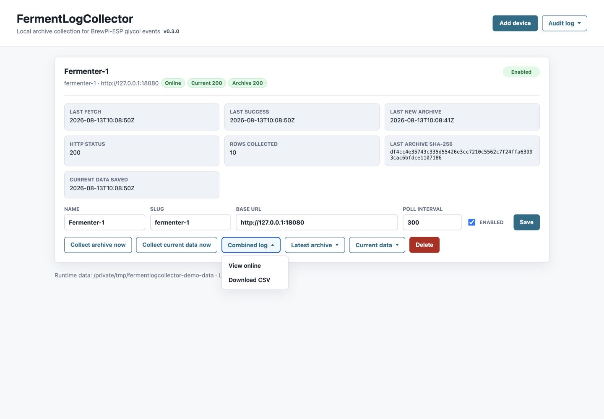

# FermentLogCollector

Small local FastAPI service that collects BrewPi-ESP glycol log archive segments.

The collector polls each enabled device at `/glycol_log.archived.csv`, hashes the
CSV with SHA-256, deduplicates already-seen archives, stores the raw archive, and
appends only new data rows to a long per-device combined CSV.



## Requirements

- Linux with Python 3.11 or newer
- Git
- The Python virtual environment module

On Raspberry Pi OS or Debian:

```sh
sudo apt update
sudo apt install -y git python3-venv
```

## Quick Test

This keeps the application and its collected data in the current user's home
directory:

```sh
git clone --branch v0.1.1 --depth 1 https://github.com/RikyTres/FermentLogCollector.git
cd FermentLogCollector
python3 -m venv .venv
.venv/bin/python -m pip install -c requirements.lock .
FERMENT_COLLECTOR_DATA_DIR="$PWD/data" .venv/bin/python -m uvicorn ferment_log_collector.main:app --host 0.0.0.0 --port 8000
```

Open `http://<raspberry-pi-ip>:8000` from another computer, or
`http://127.0.0.1:8000` directly on the Raspberry Pi. Stop the test with
`Ctrl+C`.

## Permanent Installation

The included `systemd` service starts the collector at boot, runs it without
root privileges, and stores persistent state under
`/var/lib/fermentlogcollector/`.

```sh
sudo git clone --branch v0.1.1 --depth 1 https://github.com/RikyTres/FermentLogCollector.git /opt/FermentLogCollector
sudo python3 -m venv /opt/FermentLogCollector/.venv
sudo /opt/FermentLogCollector/.venv/bin/python -m pip install -c /opt/FermentLogCollector/requirements.lock /opt/FermentLogCollector
sudo install -m 0644 /opt/FermentLogCollector/deploy/fermentlogcollector.service /etc/systemd/system/fermentlogcollector.service
sudo systemctl daemon-reload
sudo systemctl enable --now fermentlogcollector
```

Check the service and recent logs with:

```sh
sudo systemctl status fermentlogcollector
sudo journalctl -u fermentlogcollector -n 50 --no-pager
```

On first launch, add your BrewPi-ESP device from the web GUI. New installations
do not create a default device.

## Updating

Updates remain pinned to an explicit release. The following example updates to
a future `v0.1.2` release:

```sh
sudo git -C /opt/FermentLogCollector fetch --depth 1 origin tag v0.1.2
sudo git -C /opt/FermentLogCollector checkout v0.1.2
sudo /opt/FermentLogCollector/.venv/bin/python -m pip install -c /opt/FermentLogCollector/requirements.lock /opt/FermentLogCollector
sudo systemctl restart fermentlogcollector
```

## Development Quick Start

```sh
python3 -m venv .venv
.venv/bin/python -m pip install -c requirements.lock -e ".[dev]"
.venv/bin/python -m uvicorn ferment_log_collector.main:app --reload
```

## Notes

- New installations start with no configured devices. Add the first device from
  the web GUI.
- Use the device IP address for the Base URL, for example
  `http://192.168.1.50`. Hostnames ending in `.local` rely on mDNS/Bonjour and
  may resolve slowly or fail from the collector process even when they work in a
  browser.
- Persistent installations store the database under
  `/var/lib/fermentlogcollector/data/` and logs under
  `/var/lib/fermentlogcollector/logs/`.
- Device files are stored by stable slug, for example
  `logs/devices/fermenter-1/`.
- HTTP 404 from `/glycol_log.archived.csv` is treated as a normal "no archive
  yet" state.
- `/glycol_log.csv` can be fetched on demand as a live snapshot from the UI.
- Audit logs are plain text and rotate monthly under `logs/collector/`.
- This repository is only the remote collector. It does not include firmware
  changes.
